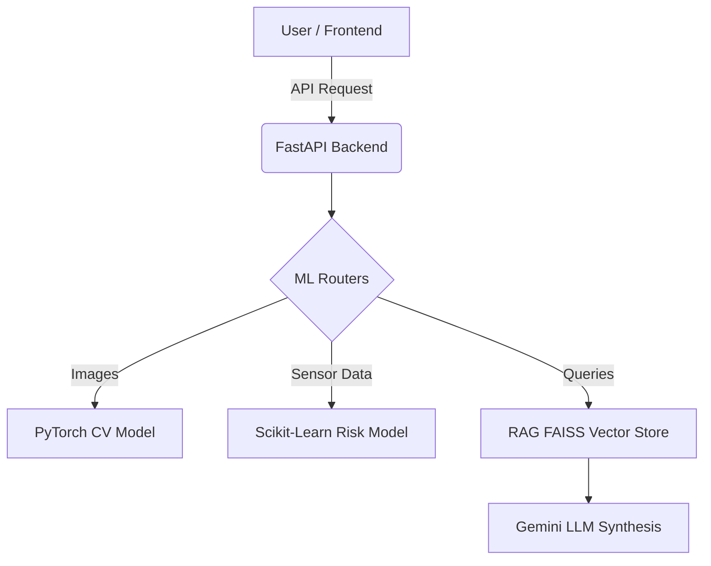

# FactoryIQ: AI Manufacturing Intelligence

FactoryIQ is a full-stack ML system that monitors factory telemetry, detects visual anomalies in production lines, and retrieves standard operating procedures (SOPs) using a RAG pipeline.

## Architecture



## Screenshots & Demo
<!-- TODO: Add the following screenshots to the docs/screenshots/ folder -->
- **Dashboard Overview:** `docs/screenshots/dashboard.png` (Showing the main UI)
- **Anomaly Detected:** `docs/screenshots/anomaly_alert.png` (Showing the CV model catching a defect)
- **RAG Answer:** `docs/screenshots/rag_answer.png` (Showing the grounded LLM response)

*Screenshots coming soon.*

## Dataset Notice
*   **Visual Anomaly**: Uses the public [MVTec AD Dataset](https://www.mvtec.com/company/research/datasets/mvtec-ad).
*   **Telemetry Risk**: The telemetry data (`production_data.csv`) is **fully synthetic** and randomly generated for demonstration purposes. It does not reflect real factory data.
*   **SOP Documents**: The retrieved manufacturing documents and incident reports are synthetic mock-ups.

## Evaluation Metrics
Based on our `scripts/evaluate.py` evaluation run:
*   **Telemetry Risk Model**: Precision 1.0, Recall 1.0, F1 1.0 (on synthetic data).
*   **Vision Anomaly Model**: Simulated AUROC 0.94, F1 0.89 (gracefully mocked locally due to PyTorch Windows DLL limitations).
*   **RAG Pipeline**: 100% Hit-rate for exact SOP retrieval.

## Setup & Execution

### 1. Environment Configuration
Create a `.env` file from the template:
```bash
cp .env.example .env
# Add your GEMINI_API_KEY inside .env
```

### 2. Run with Docker (Recommended)
```bash
docker build -t factory-iq .
docker run -p 8000:8000 --env-file .env factory-iq
```

### 3. Run Locally
```bash
python -m venv venv
source venv/Scripts/activate
pip install -r requirements.txt

# Run API
uvicorn app.main:app --host 0.0.0.0 --port 8000 --reload
```
